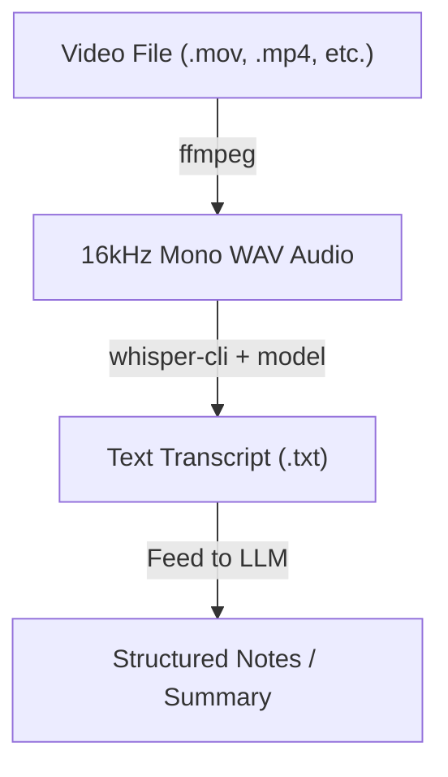

# Local Speech-to-Text Guide: Video to Transcript

This guide explains how to take any video (like a macOS screen recording) and locally transcribe it into text using `ffmpeg` and `whisper.cpp` on your Mac.

---

## 🔄 The Core Workflow

Here is how the pipeline processes any video file:



1. **Audio Extraction:** `ffmpeg` strips the video and converts the audio track into a **16-bit PCM WAV file at 16000Hz (mono)**. Whisper is optimized specifically for 16kHz mono audio.
2. **Local ASR (Speech-to-Text):** `whisper-cli` loads a pre-trained model and transcribes the WAV file locally on your Mac's GPU (using Apple Silicon Metal acceleration).
3. **Post-processing:** The temporary WAV file is deleted, and a clean text transcript is generated.

---

## 🚀 How to Run the Automated Script

We created an automation script on your Desktop: **[`transcribe.py`](file:///Users/aashish/Desktop/transcribe.py)**. 

To transcribe all video files on your Desktop:
1. Place your video files (`.mov` or `.mp4`) on your Desktop.
2. Open your terminal and run:
   ```bash
   python3 ~/Desktop/transcribe.py
   ```
*This script will automatically detect the videos, convert them, download the base model if missing, transcribe them, and open the output `.txt` files.*

---

## 🛠 How to Transcribe Manually (Any Video, Any Location)

If you have a video in a different directory (e.g., `~/Downloads/tutorial.mov`) and want to transcribe it manually:

### Step 1: Extract the Audio
Run `ffmpeg` to extract the exact audio format required by Whisper:
```bash
ffmpeg -y -i "/path/to/your/video.mov" -ar 16000 -ac 1 -c:a pcm_s16le "/path/to/output_audio.wav"
```
* **`-ar 16000`**: Resamples audio to 16kHz.
* **`-ac 1`**: Converts to mono channel.
* **`-c:a pcm_s16le`**: Encodes as 16-bit PCM.

### Step 2: Download a Whisper Model (If you haven't already)
```bash
whisper-cpp-download-ggml-model base.en
```
*Models are saved in `~/.cache/whisper-cpp/`.*

### Step 3: Run the Transcription
```bash
whisper-cli -m ~/.cache/whisper-cpp/ggml-base.en.bin -f "/path/to/output_audio.wav" -otxt
```
* **`-m`**: Path to the downloaded model.
* **`-f`**: Path to the WAV audio file.
* **`-otxt`**: Automatically exports to a text file.

---

## 📝 How to Generate Masterclass Notes (LLM Prompt)

Once you get the raw transcript text, copy and paste it into Claude, ChatGPT, or Gemini with the following prompt:

> **Developer Prompt for Notes:**
> "I have a raw transcript of a software engineering video/masterclass. Please analyze it and extract:
> 
> 1. **Architecture & System Design:** Draw any architectures or system diagrams discussed in Mermaid.js syntax.
> 2. **Core Concepts ('Aha!' Moments):** Key takeaways and expert level insights that set this apart from basic tutorials.
> 3. **Actionable Implementation Logic:** List code patterns, APIs, algorithms, or configuration files discussed, including sample code."
